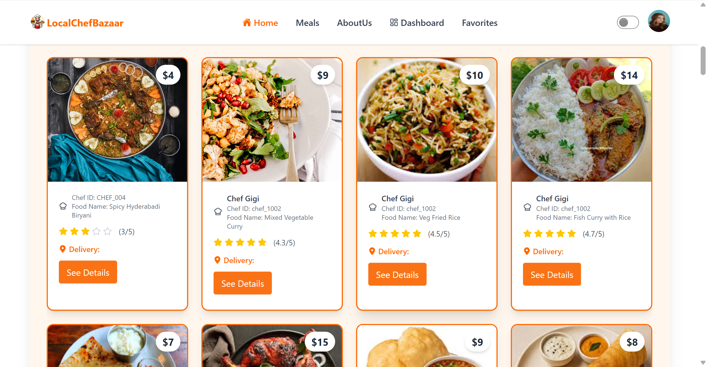

# 🍲 LocalChefBazaar



**Live Demo:** 🔗 https://local-chef-bazaar-a84fe.web.app

LocalChefBazaar is a community-focused online marketplace that connects local home chefs with food lovers who crave fresh, homemade meals. The platform empowers talented home cooks to showcase their dishes while allowing users to discover, order, and enjoy authentic food made with care — all from their neighborhood.

Built with a modern MERN stack, LocalChefBazaar delivers a smooth, responsive, and engaging user experience with powerful frontend tools and a scalable backend.

---

## ✨ Features List

### 👩‍🍳 For Food Lovers
- Explore a wide variety of homemade meals from local chefs
- View detailed meal information with ratings & reviews
- Save favorite meals for quick access
- Enjoy a fast, responsive, and user-friendly interface
- Real-time updates for newly added meals
- Order meals from local chefs
- Write and view reviews

### 🧑‍🍳 For Home Chefs
- Add, update, and manage your own meals
- Share authentic recipes and signature dishes
- Build your reputation through user reviews
- Reach customers without running a physical restaurant
- View and manage order requests

### 🌍 Platform Highlights
- Fully responsive design for mobile, tablet, and desktop
- Smooth animations and transitions
- Secure authentication and role-based access (User, Chef, Admin)
- Modern UI/UX built with reusable components
- Dashboard for different user roles

---

## 🛠 Tech Stack

| Category | Technology |
|----------|-------------|
| **Frontend** | React 19, Tailwind CSS, DaisyUI |
| **Animations** | Framer Motion |
| **State Management** | TanStack React Query |
| **Routing** | React Router 7 |
| **Forms** | React Hook Form |
| **Backend** | Node.js, Express.js |
| **Database** | MongoDB |
| **Authentication** | Firebase Auth |
| **Hosting** | Firebase Hosting |
| **Charts** | Recharts |
| **Icons** | React Icons, Lucide React |
| **Build Tool** | Vite 7 |

---

## 💻 Local Setup Instructions

### Prerequisites
- Node.js (v18+)
- npm or yarn

### Installation Steps

```bash
# 1. Navigate to the project directory
cd local-Chef-Bazaar-client

# 2. Install dependencies
npm install

# 3. Create .env file (if needed)
# Add your MongoDB connection string and Firebase config
VITE_FIREBASE_API_KEY=your_key
VITE_FIREBASE_AUTH_DOMAIN=your_domain
VITE_FIREBASE_PROJECT_ID=your_project_id
VITE_FIREBASE_STORAGE_BUCKET=your_bucket
VITE_FIREBASE_MESSAGING_SENDER_ID=your_sender_id
VITE_FIREBASE_APP_ID=your_app_id

# 4. Run development server
npm run dev
```

The app will run at `http://localhost:5173`

### Build for Production
```bash
npm run build
```

### Preview Production Build
```bash
npm run preview
```

---

## 📦 Major Dependencies

| Package | Description |
|---------|-------------|
| tailwindcss | Utility-first CSS framework |
| @tanstack/react-query | Data fetching & caching |
| axios | HTTP client |
| firebase | Authentication & backend services |
| framer-motion | Animations |
| react-hook-form | Form management |
| react-router | Client-side routing |
| react-rating | Rating system |
| react-toastify | Toast notifications |
| sweetalert2 | Alert & confirmation dialogs |
| recharts | Data visualization |
| lucide-react | Modern icon set |
| react-icons | Popular icon libraries |

---

## 🛠 Installation & Setup

Follow these steps to run the project locally:

```bash
# Navigate to the project directory
cd local-Chef-Bazaar-client

# Install dependencies
npm install

# Start the development server
npm run dev
```

---

## 🔐 Environment Variables

Create a `.env` file in the root directory and add:

```env
VITE_FIREBASE_API_KEY=your_key
VITE_FIREBASE_AUTH_DOMAIN=your_domain
VITE_FIREBASE_PROJECT_ID=your_project_id
VITE_FIREBASE_STORAGE_BUCKET=your_bucket
VITE_FIREBASE_MESSAGING_SENDER_ID=your_sender_id
VITE_FIREBASE_APP_ID=your_app_id
```

---

## 📌 Future Improvements

- Online payment integration
- Order tracking system
- Chef dashboards with analytics
- Advanced search & filters

---

## 🤝 Contributing

Contributions, issues, and feature requests are welcome.
Feel free to fork the project and submit a pull request.

---

## 📜 License

This project is for educational and portfolio purposes.
